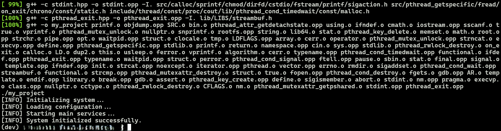
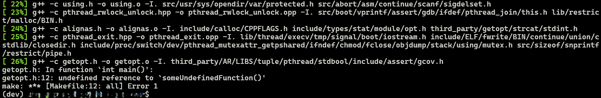

# fake_compiler

> 할 것 없이 매우 나른했던 휴일. Youtube도 볼게 없고, 나가기도 귀찮았던 어느날 아무생각없이 재밌겠다 하면서 코딩한 결과 나는 회사에서 월급루팡의 경지를 한층 더 진화시켰다.

그 이름은 바로 'Fake_Compiler' 
목적은 매우 간단하다. '무언가 엄청난걸 컴파일 해주는 척 하기'

구현된 기능은 아래와 같다
- g++ compile의 printing format은 고정한 채, 그럴듯한 단어들을 랜덤으로 채워서 출력
- Dependency 출력 (Path의 길이와 단어 역시 랜덤)
- 컬러풀한 진행률 표시
- 0.1%확률로 Error 발생 후 Make error message 출력
- Error없이 완료되면 compile 결과와 완료 결과 출력

### [성공시]



### [실패시]


코드는 Python으로 구현되어있지만 출력되는건 C++ Compling이 웃긴 포인트다.
최대한 그럴듯하게 보이게하려고 이것저것 기억나는대로 넣어봤다.

Compile Error가 구현되어있어서 나름 쫄깃한 컴파일링 모니터링을 할 수 있다. 아무런 의미없는 가짜 컴파일 화면이지만 error가나면 이유없이 짜증이난다. 반대로 error없이 무사히 컴파일이 되면 묘하게 기분이 좋으면서 불안하다.

Debuging해야 할 것 만 같지만 할 Debuging은 없다 :)

이로써, 일은 많은데 머리가 안돌아가 아무것도 하기 싫지만 그렇다고 아무것도 하지 않을 수 없는 애매한 평일 오후 시간에 어느정도 철판을 깔고 멍 때릴 수 있게 되었다.

> 출력될 줄 수는 원래 입력값으로 받았으나 그냥 고정시켰다. 코드 main에 num_files를 조정해 원하는만큼 멍을 떄려보자. (기본값은 119.)
> 
>  멍도 Error가 안나야 때릴 수 있는 법. Error확률또한 error_probability를 줄이거나 0으로 만들어서 Error없이 진행하게 할 수도 있다. (기본값은 0.01 [1%])

Realistic을 증가시키기 위한 다른 아이디어가 있다면, 언제든 환영이다!

코드는 아래 github repo에서 clone 후 `python3`으로 실행하면 끝!

(그럴듯한 단어들을 모아놓은 words.txt는 위대한 GPT의 도움을 받아 수집했다.)

# 🛠️ 사용법

이 프로젝트는 **주요 Python 스크립트 3개**로 구성되어 있음:
1. **`fake_compiler.py`**: 원조 가짜 컴파일러 스크립트
2. **`fake_compiler_v2.py`**: 좀 더 현실적인 출력과 커맨드 옵션이 추가된 가짜 컴파일러 버전
3. **`fake_ml_trainer.py`**: 머신러닝 모델 학습 과정을 시뮬레이션하는 스크립트

## `fake_compiler.py`

 가장 기본적인 스크립트
**실행 방법**
`python3 fake_compiler.py`
스크립트 내부에서 `num_files`와 `error_probability` 값을 수정하면  
출력 줄 수(=가짜 컴파일 파일 수)와 **에러 발생 확률**을 조절할 수 있음.

### `fake_compiler_v2.py`

CLI 옵션으로 더 세밀한 커스터마이징 가능
**실행 방법**
`python3 fake_compiler_v2.py [옵션들]`

**사용 가능한 옵션**

| 옵션            | 설명                                      | 기본값   |
| ------------- | --------------------------------------- | ----- |
| `--theme`     | 컴파일러 테마 (`g++`, `clang`, `cl.exe` 중 선택) | `g++` |
| `--num_files` | "컴파일"할 파일 수                             | `150` |

**예시**
`python3 fake_compiler_v2.py --theme clang --num_files 200`

---

### `fake_ml_trainer.py`
머신러닝 학습 과정을 흉내내는 시뮬레이터

**실행 방법**
`python3 fake_ml_trainer.py [옵션들]`

**사용 가능한 옵션**

|옵션|설명|기본값|
|---|---|---|
|`--epochs`|학습 epoch 수|`25`|
|`--batch_size`|배치 크기|`64`|
|`--lr`|학습률 (Learning Rate)|`0.001`|
|`--dataset_size`|데이터셋 크기|`10000`|

**예시**
`python3 fake_ml_trainer.py --epochs 50 --lr 0.01`


-------
-------

> A drowsy weekday afternoon at 3 PM, you might need this. Prepare your terminal and this code. With a single execution, you can take a mental break during work without your boss noticing!

A very lazy holiday with nothing to do.
There was nothing interesting on YouTube, and I was too lazy to go out. On a day like that, I coded something while giggling to myself, thinking it would be fun.
I have taken my office time-wasting skills to a new level.

The name is 'Fake_Compiler'
The purpose is very simple: 'To pretend to be compiling something grand.'

If you look at the source code, it’s just child’s play coding.
Anyone can do it, but it’s the kind of task that no one would bother to do.
A holiday with nothing to do made me do it.

### The implemented features are as follows:

- Output the g++ compile printing format with plausible words filled in randomly.
- Output dependencies (the length of the path and words are also random).
- Colorful progress display.
- 0.1% chance of an error occurring, followed by a Make error message.
- If completed without errors, output the compile result and completion message.

### [On Success]


### [On Failure]


The code is implemented in Python, but what gets printed is a C++ compilation, which is the funny part.
I tried to make it look as plausible as possible by adding everything I could remember.

With the compile error implemented, you can monitor the fake compiling with a bit of tension. It’s a meaningless fake compile screen, but if an error occurs, it’s inexplicably annoying. On the other hand, if it compiles without errors, it feels oddly satisfying yet uneasy.

It feels like you should be debugging, but there’s nothing to debug. :) 

With this, during those ambiguous weekday afternoons when you have a lot of work but your brain isn’t working and you don’t want to do anything, you can now slack off with some confidence.

> The number of output lines was initially an input value but was fixed later. Adjust num_files in the main code to slack off as much as you want. (The default is 119, reflecting the sentiment of "Please save me, I want to go home.")

> You can only slack off if there are no errors. You can reduce the error probability or set it to 0 with error_probability to proceed without errors. (The default is 0.01 [1%])

Any other ideas to increase realism are welcome!

You can clone the code from the GitHub repo below and run it with python3!

(The plausible words were collected with the help of the great GPT-4.)

## 🛠️ Usage

This project contains three main Python scripts:

1.  **`fake_compiler.py`**: The original fake compiler script.
2.  **`fake_compiler_v2.py`**: An enhanced version of the fake compiler with more realistic output and command-line options.
3.  **`fake_ml_trainer.py`**: A script that simulates a machine learning model training process.

### `fake_compiler.py`

This is the basic script. To run it, simply execute the following command:

```bash
python3 fake_compiler.py
```

You can modify the `num_files` and `error_probability` variables directly in the script to control the length of the simulation and the likelihood of encountering a fake error.

### `fake_compiler_v2.py`

This version offers more customization through command-line arguments:

```bash
python3 fake_compiler_v2.py [options]
```

**Options:**

*   `--theme`: Choose the compiler theme. Options are `g++` (default), `clang`, or `cl.exe`.
*   `--num_files`: Set the number of files to "compile" (default: 150).

**Example:**

To simulate a compilation with the `clang` theme and 200 files, run:

```bash
python3 fake_compiler_v2.py --theme clang --num_files 200
```

### `fake_ml_trainer.py`

This script simulates the training of a machine learning model. You can customize the training parameters using command-line arguments:

```bash
python3 fake_ml_trainer.py [options]
```

**Options:**

*   `--epochs`: Number of training epochs (default: 25).
*   `--batch_size`: Batch size for training (default: 64).
*   `--lr`: Learning rate (default: 0.001).
*   `--dataset_size`: Total size of the fake dataset (default: 10000).

**Example:**

To simulate training for 50 epochs with a learning rate of 0.01, run:

```bash
python3 fake_ml_trainer.py --epochs 50 --lr 0.01
```
